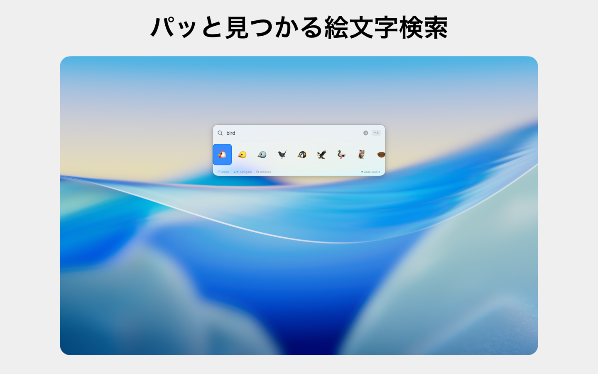
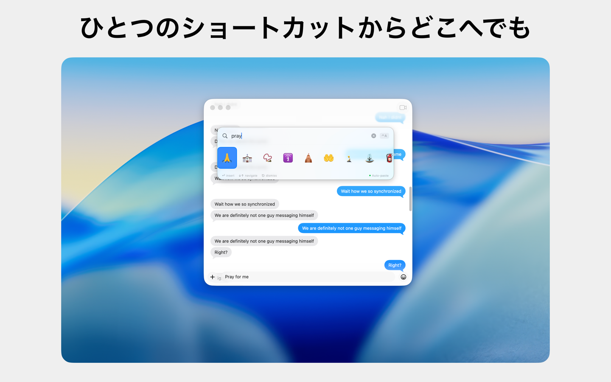
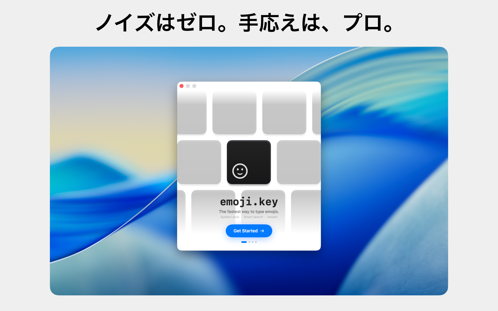
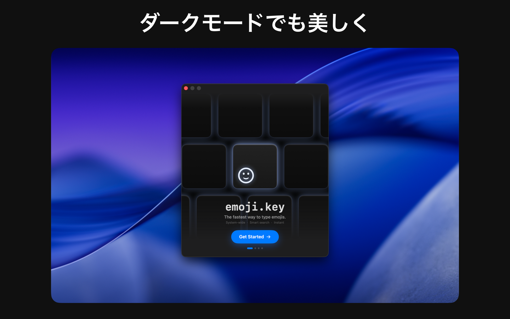

<p align="center">
  
</p>

<h1 align="center">emoji.key</h1>

<p align="center">
  <strong>The fastest way to search and insert emojis on macOS.</strong><br>
  System-wide · Smart search · Instant keyboard workflow
</p>

<p align="center">
  
  
  
  
</p>

---

<p align="center">
  
</p>

## ✨ Highlights

- **⚡ Instant Summoning**: Hit <kbd>⌘</kbd> <kbd>⇧</kbd> <kbd>E</kbd> anywhere to open a floating, Spotlight-style emoji search HUD.
- **🔍 Smart Bilingual Search**: Search emojis in **English** and **Japanese** by name, category, or semantic keyword (e.g., `bird`, `pray`, `お祝い`, `犬`).
- **📋 Auto-Paste or Copy**: Press <kbd>↩</kbd> to copy the selected emoji. With optional Accessibility permissions granted, it automatically pastes straight into your active application.
- **🛡️ 100% App Sandbox Compliant**: Built using modern Carbon `RegisterEventHotKey` APIs and `SMAppService` login item management.
- **🎨 Beautiful Light & Dark Modes**: Seamlessly matches your macOS system appearance with a native vibrancy design.
- **🚀 Native & Lightweight**: Written in Swift with SwiftUI and AppKit. Zero heavy dependencies.

---

## 📸 Screenshots

| Instant Search | Everywhere in Any App |
|:---:|:---:|
|  |  |

| Welcome & Onboarding | Dark Mode |
|:---:|:---:|
|  |  |

---

## ⌨️ Keyboard Shortcuts

| Shortcut | Action |
|---|---|
| <kbd>⌘</kbd> <kbd>⇧</kbd> <kbd>E</kbd> | Toggle emoji search HUD (customizable in Settings) |
| <kbd>←</kbd> / <kbd>→</kbd> or <kbd>↑</kbd> / <kbd>↓</kbd> | Navigate emoji candidates |
| <kbd>↩</kbd> (Return) | Select emoji and paste/copy |
| <kbd>⎋</kbd> (Esc) | Dismiss search window |

You can customize your preferred global keyboard shortcut at any time in **Settings → General → Keyboard Shortcut**.

---

## 🛠️ Requirements & Building

### Requirements
- macOS 14.0 (Sonoma) or later
- Xcode 15.0 or later

### Build with Xcode
1. Clone this repository:
   ```bash
   git clone <repo-url>
   cd emojiTool
   ```
2. Open `emojiTool.xcodeproj` in Xcode.
3. Select the `emojiTool` scheme and your Mac target.
4. Press <kbd>⌘</kbd> <kbd>R</kbd> to build and run.

### Build from Command Line
```bash
xcodebuild -project emojiTool.xcodeproj \
  -scheme emojiTool \
  -destination 'platform=macOS' \
  build
```

---

## 🏗️ Architecture & How It Works

### Sandbox-Safe Global Hotkey
Rather than using `NSEvent.addGlobalMonitorForEvents` (which requires elevated privileges and breaks App Sandbox), **emoji.key** uses Carbon's `RegisterEventHotKey`:
```
App Launches
   ↓
HotkeyManager.register()
   ↓
Carbon: InstallEventHandler + RegisterEventHotKey(kVK_ANSI_E, cmdKey | shiftKey)
   ↓
User triggers shortcut anywhere
   ↓
SearchWindowController activates & orders front NSPanel
   ↓
InterceptingTextField receives instant first-responder focus
```

### Paste Pipeline
When you press <kbd>↩</kbd> or click an emoji:
1. `NSPasteboard.general` is updated with the selected emoji.
2. If **Auto-paste** is enabled and Accessibility permission is granted:
   - Frontmost application is reactivated.
   - A synthetic <kbd>⌘</kbd> <kbd>V</kbd> key event pastes the emoji directly into the text field.
3. If Accessibility is not enabled, the emoji remains in your clipboard ready for standard manual pasting.

### Modern Login Item Management
Uses macOS 13+ **`SMAppService.mainApp`** for reliable, App Store-approved login item registration without legacy background helper daemons.

---

## 📁 Repository Structure

```
emojiTool/
├── emojiTool.xcodeproj/         # Xcode project and shared schemes
├── emoji/
│   ├── FastMojiApp.swift        # App entry point (@main) & Settings scene
│   ├── AppDelegate.swift        # AppKit lifecycle, status bar, and menus
│   ├── HotkeyManager.swift      # Carbon RegisterEventHotKey global shortcut handler
│   ├── SearchWindowController.swift # Floating NSPanel controller & view model
│   ├── SearchView.swift         # SwiftUI Spotlight search interface
│   ├── PasteManager.swift       # Clipboard & synthetic paste automation
│   ├── SettingsView.swift       # Preferences window (hotkey, login item, paste mode)
│   ├── OnboardingView.swift     # Interactive first-launch introduction flow
│   ├── EmojiStore.swift         # Search engine, fuzzy matching & frequency tracking
│   ├── EmojiEntry.swift         # Emoji data models
│   ├── FastMoji.entitlements    # App Sandbox configuration
│   ├── unicode_master.json      # Unicode emoji database
│   ├── emoji_ja.json            # Japanese translations and aliases
│   ├── github_emojis.json       # GitHub / Slack shortcode aliases
│   └── Assets.xcassets/         # Icons and menu bar vector assets
├── assets/                      # Repository hero artwork, icons, and screenshots
├── Info.plist                   # Application bundle configuration
├── Localizable.xcstrings        # Localization catalog (English & Japanese)
└── README.md                    # Project documentation
```

---

## 👤 Author & Copyright

Designed and developed by **Reona Monga**.  
Copyright © 2026 Reona Monga. All rights reserved.
